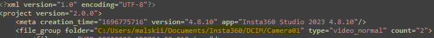

# Insta360-Studio-Project-Mover
Transfer your Insta360 Studio project settings when source video location changes.

## About
This project offers a Bash script that modifies Insta360 Studio project, enabling changes to the source of video files without losing the projects themselves. To the best of my knowledge, as of the time of writing, there is no solution for this provided by Insta360 or the community..

## Instructions
**Before running the script take backup of your Insta360 Studio project directory.**

Use the script at your own risk! While it has worked well for me, your experience may vary.

Gather following information before executing the script:
1. Path to your project files.
2. Path to the old video source.
    - This information can be found within one of the Studio project files (*.insprj) under the 'file_group folder' item.
    
3. Path to the new video source.

Run the script with the collected values.

After executing the script, configure Insta360 Studio to use these new project files.

## More information
There is an excellent guide written by Philipp Kolloczek available here: https://insta.pk360.de/#studio202x_insprj/ It provides a comprehensive explanation of Insta360 Studio project management and the utilization of project directories. Essentially, this script is written upon the knowledge gathered from that site.